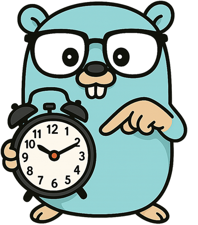

[](https://github.com/cardinalby/wallclock/actions/workflows/test.yml)
[](https://github.com/cardinalby/wallclock/actions/workflows/list.yml)
[](https://pkg.go.dev/github.com/cardinalby/wallclock)

# Golang wall-clock alarm

<p align="center">
   
</p>

A Go library that provides **wall-clock** aware **alarms** that fire at specific wall times, 
handling system clock adjustments gracefully. 

Use it instead of `time.NewTimer` if you need to schedule an event at a specific time.

### Quick Example

```bash
go get github.com/cardinalby/wallclock
```
```go
import "github.com/cardinalby/wallclock"

now := time.Now()               // 2025-06-17 12:00:00
fireAt := now.Add(time.Hour)    // 2025-06-17 13:00:00
alarm := wallclock.NewAlarm(fireAt)
firedAt := <-alarm.C() // fires at 2025-06-17 13:00:00
```

### Why not a simple Timer?

Timers are set to fire after a duration, but they don't account for changes in the system clock.
- It can fire **before** the expected time if the clock jumps **forward**.
- It can fire **after** the expected time if the clock jumps **backward**.

### Implementation Details

The lib use a timer internally, but is designed to fire at specific wall clock times:
1. If the system clock **jumps backward**, we see it when a timer fires and **reset** it according 
   to the new wall clock time.
2. There is a **background monitor** that detects **forward** clock **jumps** and adjusts the 
   timers accordingly.

### Features

1. **Thread-safe** and **efficient**, uses internal event loop to manage alarms.
2. **Configurable** delay tolerance to balance precision and CPU usage.

### Options

Optional params can be passed to `NewAlarm()` to control how sensitive the alarm is to clock jumps to the future

#### 🔵 **`WithAllowedDelay(time.Duration)`**

Sets the maximum allowed delay for the alarm. This controls how often the system checks for clock 
changes and how precise the firing time is. **Default is 1 second**.

```go
alarm := wallclock.NewAlarm(
	fireAt, 
	wallclock.WithAllowedDelay(time.Minute), 
)
```

#### 🔵 **`WithAnyAllowedDelay()`**

Disables background clock jump-forward monitor for the alarm. 

Jumps to the past will still be handled.

```go
alarm := wallclock.NewAlarm(
	fireAt, 
	wallclock.WithAnyAllowedDelay(), 
)
```

### Alarm interface

```go
// Alarm is an interface that represents a timer that will fire at a specific wall time.
// It is designed to handle wall clock adjustments, ensuring that the alarm fires at the correct wall time
type Alarm interface {
	// C returns a channel that will receive the time when the alarm fires.
	// Channel is buffered and will receive a value only once
	C() <-chan time.Time

	// Stop stops the alarm, returning false if the alarm has already expired or been stopped
	Stop() bool
}
```